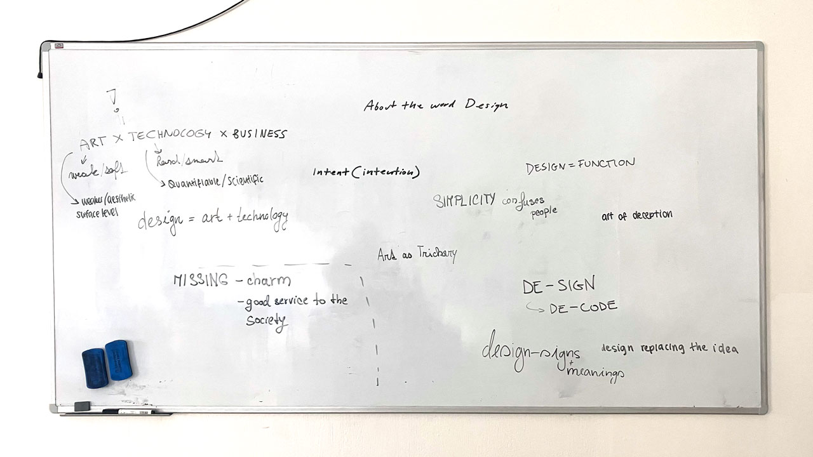

# Design Manifesto

by Justin Gagne

## First Things First

> This is a quote
>
> — Author

This is a paragraph. This could also be an introductory paragraph to your manifesto. 

Another paragraph with a link to an external page, [The Poltics of Design](http://thepoliticsofdesign.com/about-the-book). And this is a link (jump link) to an internal section (heading) within this page, [First Things First](#first-things-first) (notice the URL change on click: `…/01-design-manifesto/#first-things-first`).

## Principles

1. Principle
2. Principle
3. Principle
